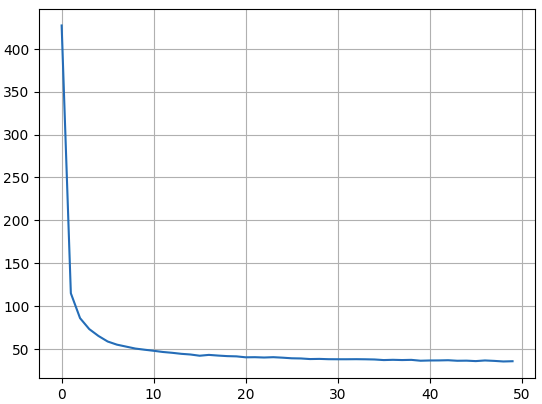
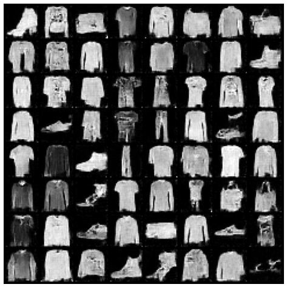

# min_score_based_SDE
Minimal implemetation of Score-based SDE

ToDo
- [x] Implement VP-SDE
- [x] Implement Euler-Maruyama 
- [] Impelemnt Predictor-Corrector
- [] VE-SDE

# VP - SDE
Noise scheduler from $\beta_1 → \beta_N$ we converge to $\beta(t), t \in [0, \frac{1}{N}, \dots, \frac{N-1}{N}]$ and the discrete version of VP-SDE is
$$
x(t+\Delta t) = x(t) -\frac{1}{2} \beta(t) x(t) \Delta t + \sqrt{\beta(t) \Delta t} \epsilon 
$$
→ $\beta(0) \Delta_t= \beta_1$ and $\beta(t) \Delta t= \beta_N$ and $\beta(t) = \frac{\beta_1}{\Delta t} + \frac{t}{\Delta t} (\beta_N - \beta_1)$. Let's denote $\bar{\beta_i} = \beta_i \Delta t$ we have $\beta(t) = \bar{\beta_1} + t (\bar{\beta_N} - \bar{\beta_1})$

From paper we have marginal $p(x_t|x_0) = \mathcal{N}(x_t;\alpha(t) x_0, \sigma^2(t) I)$ and
$$
\begin{align} \mu(t) &= \alpha(t)x_0 = \text{exp}(c(t)) x_0 \\ 
\sigma^2(t) &= 1 - \text{ exp }(2c(t))
\end{align} 
$$
where $c(t) = -\frac{1}{2} \int_0^t \beta(s) ds =-\frac{1}{2}\bar{\beta_1} t - \frac{1}{4
} t^2 (\bar{\beta_N} - \bar{\beta_1})
$ 

## Objective function
Objective function to train score-based SDE model
$$
E_{t \sim \mathcal{U}(0,1)}\| s_\theta(t, \hat{x}) - \triangledown_{\hat{x}} \text{ log }p(\hat{x}|x_0) \|
$$
The pipeline to implement `loss_fn` 

## Notes
We calculate loss function when sample $t \sim \mathcal{U}(\epsilon, 1)$ ($\epsilon$ is very small) due to prevent vanishing gradient. 

In sample function, we also solve reverse SDE from $[1, \epsilon]$. 
# How to use this code
## Train VP-SDE
Run
```
python train.py
```
The best checkpoint was saved at `./vp_sde_ckpt_best.pth`. 

### Example
Hyperparameters
- $\beta_1$ = 0.01
- $\beta_N$ = 10
- num_steps = 1000
- num_epochs = 50
- lr = 1e-4

The loss curve


Sample using Euler-Maruyama



Sample using Preditor-Corrector

